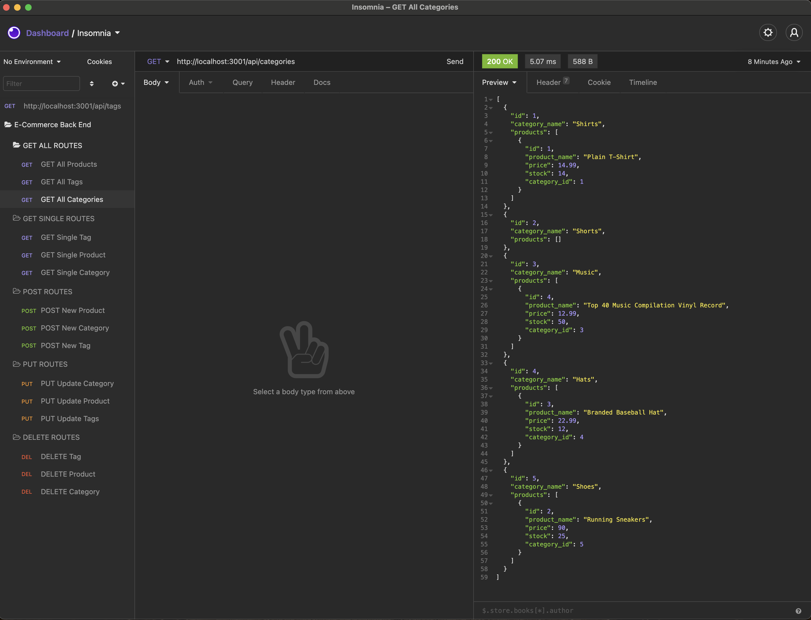

# E-Commerce-Back-End


## Table of Contents
* [Description](#description)
* [Demo](#demo)
* [Program Installation](#program-installation)
* [Program Usage](#program-usage)
* [Technologies](#technologies)
* [Links](#links)
* [Contribution](#contribution)
* [Questions](#questions)
* [License](#license)

## Description
The purpose of this application is to allow users to manage an e-commerce website.\
Upon first loading the program, the end-user will see the data in the databse system.\
User should be able to create, delete and update data in the database system.

## Demo


## Program Installation
To use this program we will need to install Node.js\
Please use the link below to download a suitable version for your OS:

[Node.js Downloads](https://nodejs.org/en/download/)

Once installed we can use your command-line interface\
(Git/Terminal - MacOS, Linux & Ubuntu, CMD/Git - Windows)\
to run browse to the main repository, then run the following command:

```bash
npm install
```

The package.json will install the necessary dependencies for the program to run.

## Program Usage
After using the program installation instructions, we can then start using the program\
Remaining in the terminal, we can use the following command to run the application:

```bash
npm run start
```

The program will then initialize and function as shown in the demo.

## Technologies
- [Dotenv](https://www.npmjs.com/package/dotenv)
- [Express](https://www.npmjs.com/package/express)
- [Javascript](https://www.javascript.com/)
- [MySQL](https://www.mysql.com/)
- [Node.js](https://nodejs.org/en/about/)
- [Sequelize](https://sequelize.org/)

## Links
- [Github Repository URL](https://github.com/Kpetiote/E-Commerce-Back-End)

## Contribution
None

## Questions
Please feel free to contact me with any questions:
- [Email](mailto:kenneth.petiote@gmail.com)
- [Github](https://github.com/Kpetiote)

## License

<br />
Licensed under the MIT License license. 